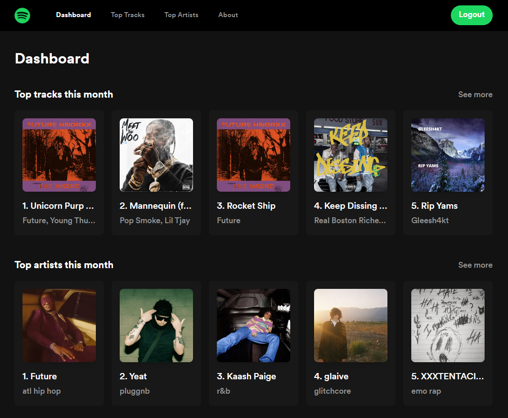

<p align="center">
  
</p>

# Spotify Dashboard

<a href="https://spotify-dashboard-demo.vercel.app">
  
</a>

## Prerequisites

- Node.js 16.x
- Yarn
- Spotify API credentials

## Getting Started

1. Clone this repository

```sh
git clone https://github.com/MaximilianHagelstam/spotify-dashboard
```

2. Follow the [docs](https://developer.spotify.com/documentation/web-api/quick-start/) to register your Spotify application
3. Create a `.env.local` file at the project root with the following:

```
NEXT_PUBLIC_SPOTIFY_CLIENT_ID=
NEXT_PUBLIC_SPOTIFY_CLIENT_SECRET=
NEXT_PUBLIC_SPOTIFY_REDIRECT_URI=
```

4. Install the dependencies and run the the app

```
yarn
yarn dev
```

## Stack

- Next.js
- Tailwind CSS
- Spotify API

## License

This project is licensed under the terms of the [MIT](https://choosealicense.com/licenses/mit/) license.
